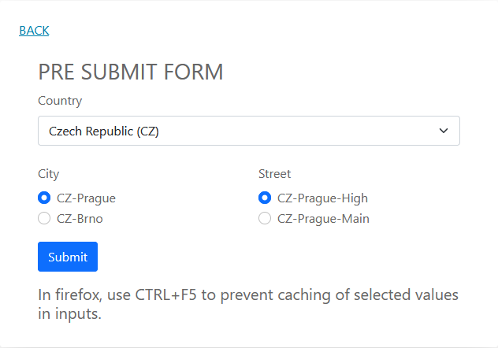

# symfony-dynamic-forms
Example of Dynamic Generation for Submitted Forms by Events in Symfony 6.
In the moment of exploring this topic, Symfony guidelines are only mentioning
simple implementation based on POST_SUBMIT event.

# Minimal requirements
- Symfony 6
- PHP 8

# How to install
    mkdir symfony-dynamic-forms 
    cd symfony-dynamic-forms
    git clone -b main https://github.com/kapcus/symfony-dynamic-forms.git .
    composer install
    

# How to run
    symfony server:start

# How to use
open the symfony server url in browser (e.g. https://localhost:8000/)

You will see 2 links:

**Test PRE SUBMIT form** - this is fully functional dynamic form based 
on PRE_SET_DATA and PRE_SUBMIT events.

  

**Test POST SUBMIT form** - this is not functional implementation based 
on PRE_SET_DATA and POST_SUBMIT events.

# The Goal of this repo
- To share PRE_SUBMIT implementation
- Verify if there is any drawback of PRE_SUBMIT implementation
- If so, find a way how to implement it with POST_SUBMIT
